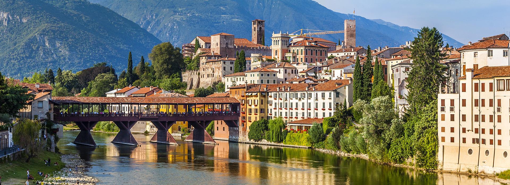
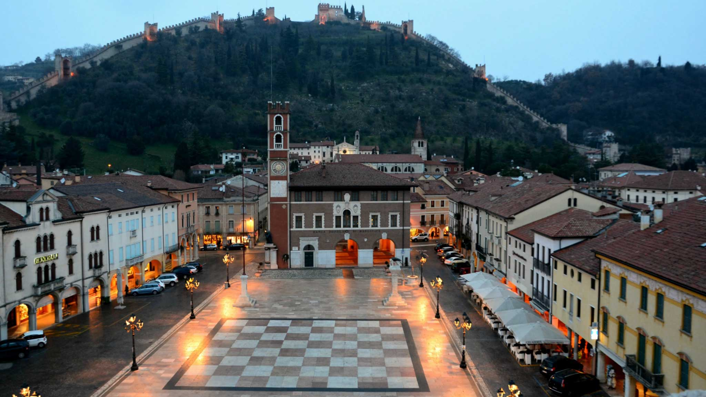
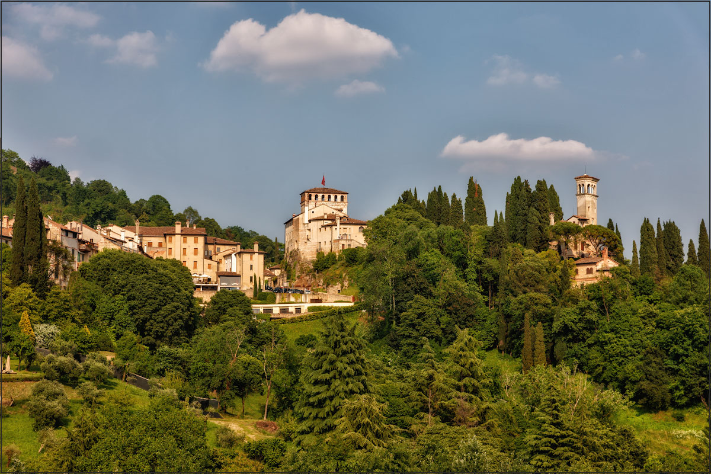
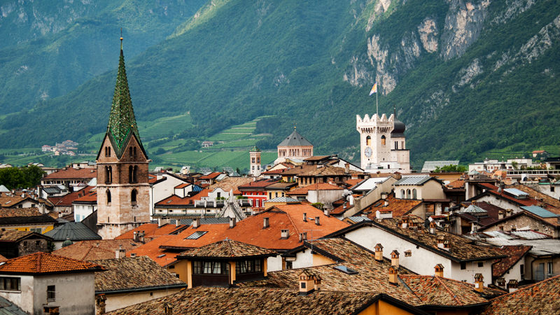
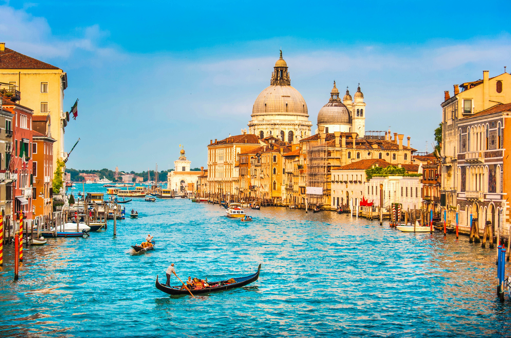
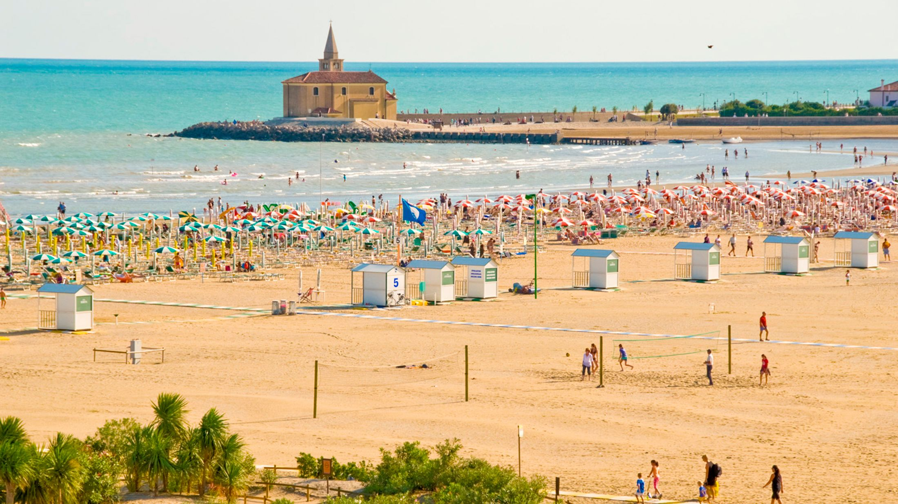

 
_Картинка: город Бассано дель Граппа_

На этой странице вы найдете полезные советы для планирования вашего путешествия в Италию на нашу свадьбу.

## Информация о свадьбе

Регистрация брака и банкет пройдут в Бассано дель Граппа (Bassano del Grappa, родной город Маттео).

### Пункт №1: Регистрация брака

__Когда:__ 6 июля, начало в 5 вечера

__Где:__ Дворец Стурм (Palazzo Sturm, Бассано)

Дворец Стурм является образцом венецианского рококо в самом сердце Бассано, всего в нескольких шагах от знаменитого моста Ponte degli Alpini (старый мост, Ponte Vecchio). Во дворце располагаются два музея: музей керамики и музей типографии. Также вы можете посетить временную выставку работ Альбрeхта Дюрера -- живописца и графика времен Ренессанса.

По субботам въезд в центр Бассано на авто ограничен  (Zona a Traffico Limitato), поэтому передвигаться по городу придется пешком.
К счастью, улицы ведущие до Дворца вымощены достаточно ровно и будут вполне доступны даже для дам на высоких каблуках. 

<!--html_preserve-->
<iframe src="https://www.google.com/maps/embed?pb=!1m14!1m8!1m3!1d11132.995392604038!2d11.7314987!3d45.7662029!3m2!1i1024!2i768!4f13.1!3m3!1m2!1s0x0%3A0xe4ba6ddd8c0ba3f3!2sPalazzo+Sturm+-+Museo+della+Ceramica+e+Museo+Remondini!5e0!3m2!1sde!2snl!4v1550311714836" width="600" height="450" frameborder="0" style="border:0" allowfullscreen></iframe>
<!--/html_preserve-->

### Пункт № 2: Банкет

__Когда:__  После регистрации брака

__Где:__ Дом родителей Маттео, Вилла Торричелле, via Torricelle 7, Romano d'Ezzelino, 36060 Италия 

__Как добраться:__ После церемонии будут организованы автобусы, чтобы перевезти гостей к месту банкета. 

Итальянская свадьба -- это очень много еды на протяжении долгого времени (как в целом и у нас, только они не ставят разные блюда одновременно, а выносят одно блюдо за раз). После десертов, ближе к полуночи начинается вечеринка с танцполом. До, во время и после вечеринки гостям будут предоставлены услуги автотранспорта, чтобы вернуться по отелям.  Автобусы будут отходить по расписанию несколько раз за ночь, так что вы сами можете решить: уехать по-раньше или остаться гулять до утра. 

<!--   -->

<!--html_preserve-->
<iframe src="https://www.google.com/maps/embed?pb=!1m18!1m12!1m3!1d2782.0905497486947!2d11.732521315054978!3d45.78941361970576!2m3!1f0!2f0!3f0!3m2!1i1024!2i768!4f13.1!3m3!1m2!1s0x4778dae449c053bb%3A0x8ac56db9fe15bea6!2sVia+Torricelle%2C+7%2C+36060+Romano+D&#39;ezzelino+VI%2C+Italien!5e0!3m2!1sde!2snl!4v1550312234452" width="600" height="450" frameborder="0" style="border:0" allowfullscreen></iframe>
<!--/html_preserve-->

### Как добраться до Бассано дель Граппа внутри Италии

Можно добраться до Бассано на поезде из Падуи (Padova) или Венеции (Venezia). Станция называется "Бассано дель Граппа," и билет стоит около 7 евро.  
Билет необходимо приобретать (а иногда и валидировать) перед посадкой на поезд. Вы можете ознакомиться с нашими рекомендациями по покупке ж/д билетов в рубрике _Общие рекомендации по Италии_.

Конечно же вы всегда можете добраться на машине. В данном случае просто воспользуйтесь навигатором Google Maps.

__Аэропорты:__  

* __Аэропорт Венеция Марко Поло (Venice Marco Polo, VCE).__ Это ближайший и самый удобный аэропорт для того, чтобы добраться до Бассано на общественном транспорте. Венеция всего в 1,5 часах от Бассано на поезде. Чтобы быстрее добраться до Бассано, вам надо сесть на автобус из аэропорта до ж/д вокзала Венеции Мэстре (Venezia Mestre, материковая часть Венеции). Оттуда вы можете сесть на поезд до Бассано. Если же вы прилетаетет заранее и хотите сперва посетить Венецию, то мы вам советуем сесть на автобус до Венеции Пиацале Рома (Piazzale Roma, островная часть Венеции). После посещения Венеции вы можете сесть на поезд на вокзале Венеция Санта Лучия (Venice Santa Lucia, острованая часть Венеции).
*  __Аэропорт Тревизо (Treviso Canova, TSF).__ Этот аэропорт удобен для тех, что путешествует лоукостерами и собирается взять машину на прокат (50 минут езды до Бассано). Однако, на общественном транспорте оттуда добираться не так уж и удобно: два поезда с пересадкой в Кастель Франко Венето (Castel Franco Veneto). Мы не рекомендуем данный аэропорт неопытным путешественникам.
* __Аэропорт Болоньи (Bologna G. Marconi, BLQ).__ Этот аэропорт расположен подальше. На общественном транспорте поездка до Бассано занимает 3 часа: сперва автобус до центральной станции Болоньи (Bologna Centrale); затем два поезда с пересадкой в Падуе. На авто путь занимает 2 часа.
* __Аэропорт Флоренции (Firenze Peretola, FLR).__ На общественном транспорте поездка занимает 3.5 часа: автобус до ж/д вокзала Флоренция Санта Мария Новелла (Firenze Santa Maria Novella), а затем скоростной поезд до Падуи, а потом электричка (regionale) до Бассано.
* __Аэропорт Милан Мальпенза (Milan Malpensa airport, MXP).__ Не очень удобный аэропрт. Из этого аэропорта не так легко добираться до самого Милана, а после из Милана не так уж легко добираться до Бассано. В итоге путь составляет больше 5 часов на общественном транспорте и 3 часа на авто.

__Авиалинии:__

Из Астаны: Проверьте Turkish Airlines, Aeroflot, KLM/AirAstana, Lufhansa, LOT (мы никогда не летали на LOT, поэтому  не знаем насколько удобно). В целом, билет должен стоить около 500 евро, если покупать заранее. 

### Где остановиться

Так как церемония будет проходить в центре Бассано, а потом транспорт будет предоставлен, то мы рекомендуем искать отели в шаговой доступности к Палаццо Стурм, месту регистрации. 

Например, проверьте следующие отели:

* [Belvedere](https://www.booking.com/hotel/it/bonotto-belvedere.ru.html?label=gen173nr-1DCAsocUIRYm9ub3R0by1iZWx2ZWRlcmVIB1gEaKkBiAEBmAEHuAEHyAEP2AED6AEB-AECiAIBqAID&sid=87f577050e60e572134c162368fe0d51&dist=0&group_adults=2&group_children=0&lang=ru&no_rooms=1&room1=A%2CA&sb_price_type=total&soz=1&type=total&lang_click=other;cdl=de;lang_changed=1)
* [Palladio](https://www.booking.com/hotel/it/top-int-bonotto-palladio.ru.html?label=gen173nr-1DCAsocUIRYm9ub3R0by1iZWx2ZWRlcmVIB1gEaKkBiAEBmAEHuAEHyAEP2AED6AEB-AECiAIBqAID&sid=87f577050e60e572134c162368fe0d51&ucfs=1&srpvid=684e625be10e0549&srepoch=1550411959&hpos=1&hapos=1&checkin=2019-07-06&checkout=2019-07-07&dest_id=-111320&dest_type=city&sr_order=popularity&all_sr_blocks=8453002_88920425_0_1_0&highlighted_blocks=8453002_88920425_0_1_0&from=searchresults;highlight_room=#hotelTmpl) (и атмосфера 70-х)
* [Brennero](https://www.booking.com/hotel/it/brennero-bassano-del-grappa.ru.html?label=gen173nr-1DCAsocUIRYm9ub3R0by1iZWx2ZWRlcmVIB1gEaKkBiAEBmAEHuAEHyAEP2AED6AEB-AECiAIBqAID;sid=87f577050e60e572134c162368fe0d51;all_sr_blocks=24350802_93906098_0_2_0;checkin=2019-07-06;checkout=2019-07-07;dest_id=-111320;dest_type=city;dist=0;group_adults=2;group_children=0;hapos=1;highlighted_blocks=24350802_93906098_0_2_0;hpos=1;no_rooms=1;room1=A%2CA;sb_price_type=total;sr_order=popularity;srepoch=1550412040;srpvid=52916284948d02db;type=total;ucfs=1&#hotelTmpl)

Большой компанией иногда выходит дешевле снимать квартиру через [airbnb](https://ru.airbnb.com/s/%D0%91%D0%B0%D1%81%D1%81%D0%B0%D0%BD%D0%BE-%D0%B4%D0%B5%D0%BB%D1%8C-%D0%93%D1%80%D0%B0%D0%BF%D0%BF%D0%B0--%D0%92%D0%B8%D1%87%D0%B5%D0%BD%D1%86%D0%B0--%D0%98%D1%82%D0%B0%D0%BB%D0%B8%D1%8F/homes?refinement_paths%5B%5D=%2Fhomes&checkin=2019-07-06&checkout=2019-07-07&query=%D0%91%D0%B0%D1%81%D1%81%D0%B0%D0%BD%D0%BE-%D0%B4%D0%B5%D0%BB%D1%8C-%D0%93%D1%80%D0%B0%D0%BF%D0%BF%D0%B0%2C%20%D0%92%D0%B8%D1%87%D0%B5%D0%BD%D1%86%D0%B0%2C%20%D0%98%D1%82%D0%B0%D0%BB%D0%B8%D1%8F&adults=2&allow_override%5B%5D=&s_tag=z7Jl5awR)

### Дресс-код

Парадно-выходной летний наряд.  В начале июля будет уже очень жарко.  Например, для мужчин костюм из тонкой шерсти, хлопка или льна. Для женщин мы рекомендуем легкие платья из хлопка, для мужчин хлопковые или льняные рубашки.  Однако, будьте также готовы на случай дождя или прохладного вечера. Для женщин мы не рекомендуем туфли на шпильках из-за мостовых в Бассано, а также торжественного приема в саду в Торричелле. Возможно, вы хотите захватить с собой шляпки, солнцезащитные очки и веера.

### Что посмотреть в Бассано

Мы рекомендуем прогуляться по центру Бассано и посетить следующие места:

* Центр: Пиацца Гарибальди, Пиацца Либерта, Пиацотто Монтевекьо (Piazza Garibaldi, Piazza Libertà, Piazzotto Montevecchio; Пиацца по-итальянски означает площадь, а пияцотто -- маленькая площадь)
* Старый мост (Ponte Vecchio)
* Музеи типографии и керамики (во Дворце Стурм, месте проведения регистрации)
* Кафе Даниели на Пияцца Либерта (Caffè Danieli in Piazza Libertà). В элегантной обстановке этого исторического кафе вы можете выпить кофе эспрессо.
* Попробуйте местный виды алкоголя - граппа, цитроновая водка, мэццо э мэццо (grappa, acqua di cedro, mezzo e mezzo) - в таверне Нардини (Nardini) на старом мосту
* Отведайте мороженое и гранолату в [Fonderia degli Artigiani](https://goo.gl/maps/XrctvDqGgLA2). Лично рекомендуем гранолату с персиками или другими сезонными фруктами.
 

## Туризм 

###  Активный отдых рядом с Бассано

Ежегодно Бассано привлекает много туристов, увлекающихся спортивными видами отдыха. 

* Рафтинг на реке Брента (очень легкие участки, доступные даже детям, заезды в гроты). Брента замечательная река, протекающая в красивой долине.
* Пара-глайдинг. 
* Горный велосипед. 
* Походы в Альпы (там даже проводят музыкальные концерты для таких туристов).

### Маростика (Marostica)

Маростика -- это средневековый город, окруженный стенами, недалеко от Бассано. Этот город знаменит проведением ежегодной шахматной игры на главное площади, где в роли шахматных фигур выступают сами жители города.  (А также это город, в котором родился Маттео!) Вы можете легко посетить Маростику, если вы на машине. [Ссылка на карту](https://goo.gl/maps/uV8eWPfwo2p)  

 

### Азоло (Asolo)

До Азоло также легко доехать на машине из Бассано. Это волшебный маленький городок, который сыскал любовь поэтов и музыкантов.  [Ссылка на карту](https://goo.gl/maps/FZyjqQyTx2L2)  

 

### Тренто (Trento)

До Тренто можно доехать на поезде из Бассано. Город расположен в регионе Трентино.  Поездка на поезде до Тренто проходит через живописные места. В этом городе сочетаются элементы итальянского и немецкого архитектурного стиля. [Ссылка на карту](https://goo.gl/maps/LYGs593mxN82)  

 

### Венеция (Venice)

И конечно же, мы рекомендуем посетить Венецию, жемчужину Италии. Если вы никогда не были в Венеции раньше, мы советуем провести здесь несколько дней. 

 

### Другие города 

Если у вас есть возможность посетить места подальше, мы рекомендуем следующие направления:

* Флоренция (3 дня и более, если вы любитель эпохи Ренессанса и музеев) + Пиза (пол дня) + дегустация вин в Кьянти (0,5 - 1 день)
* Рим (3 дня)
* Южнее Рима в июле мы не рекомендуем ехать. А так на севере можете еще захватить Чинкве-терре, но это надо ехать на поезде из Пизы.

## Пляжный отдых

Италия предоставляет богатый выбор мест для пляжного отдыха, некоторые из которых всего в 90 минутах езды от Бассано на машине. 

### Пляжи рядом с Бассано (необходим автотранспорт)

На авто вы можете посетить пляжи региона Венето на берегу Адриатики. Примечание: до этих мест также можно добраться на общественном транспорте, однако это занимает больше 2х часов от ж/д Венеция Мэстре, да еще и с пересадкой. Также мы не знаем, можно ли полагаться на расписание этих автобусов и как  часто они курсируют. 

* [Caorle](https://goo.gl/maps/zGHtWt1wwxN2)
* [Lido di Jesolo](https://goo.gl/maps/zGHtWt1wwxN2)
* [Lignano Sabbiadoro](https://goo.gl/maps/89S4RScYhxw)

Больше информации о пляжах в регионе Венето вы можете найти здесь: https://ciao.citalia.com/destination/beaches-in-veneto/

 

### Пляжи, до которых можно доехать на поезде

Проверьте пляжи рядом с Римини, там ж/д путь проходит прямо рядом с берегом.

## Шоппинг

Рядом с Венецией есть [аутлет](https://www.mcarthurglen.com/en/outlets/it/designer-outlet-noventa-di-piave/), до туда курсируют автобусы (посадка с Венеции Тронкетто Venice Tronchetto). Если вас интересует покупка обуви, возможно, вам следует посетить шопинг центры около Римини.

## Общие рекомендации по Италии

### Деньги

Лучше хранить все деньги на карточке (Виза, Мастеркард). Однако, в небольших заведениях (кафе, сувенирные лавки, и тд) особенно в небольших городах ожидается, что счет менее 10 евро оплачивается наличными.

### Еда

Что касается еды, то тут есть некоторые расхождения между казахстанскими и итальяскими традициями. Также предупреждаю, что итальянцы весьма щепетильны,  когда речь заходит об их еде, и некоторые негласные законы могут нам показаться весьма странными :)

Самый полный итальянский ужин состоит из множеcтва блюд: antipasti (закуски: включают ветчину, рыбу, патэ, и т.д.), primo  (первое блюдо: паста, ризотто, или суп), secondo (основное блюдо с мясом, рыбой, либо тарелка с сыром или салат), а также, возможно, contorno (гарнир ко второму), dolce (сладкое), затем кофе эспрессо и ammazzacaffé (ликёр после кофе). В ресторане зачастую выбирают следующие комбинации:  antipasto/primo/dolce, primo/dolce, antipasto/secondo.

Итальянцы едят мясо с кровью (al sangue) или же полностью сырым (carpaccio, battuta, tartare). Это включает говяжьи стейки и утку. Так что мы не рекомендуем заказывать мясо в Италии тем, кто не привык к мясу с кровью. Так же бессмысленно просить официантов доготовить мясо, а некоторые даже обижаются ( ну как если бы мы попросили положить кетчуп или майонез на бешпармак). Carpaccio -- это полностью сырое мясо, может выглядеть просто как фарш.

Для тех, кто не любит мясо с кровью, можно заказывать вареное мясо (bolliti) или курицу. Однако, в целом, мы рекомендуем морепродукты или сыры, так как мясо можно поесть и в Казахстане. 

В пиццериях обычно заказывают по одной пицце на человека, но вы всегда можете оставить пиццу на тарелке, если это слишком много для вас.

Итальянцы не едят пиццу на обед, только на ужин. Поэтому места, где подают пиццу на обед, зачастую являются ловушками для туристов (высокие цены - плохое качество), что приводит нас к следующему пункту.

Остерегайтесь ловушек для туристов. Это кафе и рестораны с плохой кухней, которые обычно располагаются рядом с достопримечательностями. В особенности, остерегайтесь заказывать блюда с морепродуктами, зачастую цена не за блюдо, а за 100 грамм (обычно стоит знак "per 1hg" рядом с ценой). В ресторане-ловушке официант не переспросит у наивных туристов, понятна ли им схема оплаты по весу и принесёт вам пасту с морепродуктами весом в килограмм. В итоге вы заплатите не 7 евро как предполагали, а 70 евро. Венеция "славится" такими ресторанами.

<!-- Almost all pizzerias in Italy cook good pizza, but only few of them make especially excellent pizza. The most difficult part in making a good pizza is the dough. And only few pizzaioli have truely excelled in making the right dough. There are classical pizzas like margherita. Pizzas in Italy have usually  very few components, simply because the best part is the dough and you do not want to cover the taste with another taste. Again, a simple Margherita made by an excellent pizzaiolo will be hudnred times better than a pizza with sophisticated compnents. We personally recommend  pizzerias that keep Neapolitan traditions. -->

<!-- Pasta is usually eaten for lunch.  -->

### Вино

Даже самое дешевое вино в меню достаточно хорошее :)

### Чаевые

В Италии не принято давать чаевые, если, конечно, вы не остановились в пятизведночном отеле с персоналом в униформе. В ресторанах идет фиксированная надбавка к счёту за каждого человека, называется коперто,  от 1,5 до 3-х евро за человека. Счёт за такси можно округлить до следующей ровной суммы (например, 15,13 евро до 16 евро). 

### Общественный транспорт

Мы рекомендуем покупать ж/д билеты через приложение Trenitalia: это потребует создания бесплатного личного профиля, есть версия на английском языке, и вы можете оплачивать билеты онлайн, используя прикрепленную платежную карту.

Цены на междугородние скоростные поезда (Frecciarossa, Frecciargento, Frecciabianca, Intercity)  зависят от класса обслуживания (все классы очень комфорабельны), от того, насколько заранее вы берете билет, и от условий по возрату и обмену. По этим билетам вы сразу выбираете посадочное место.

Региональеые поезда (Regionali) или по-нашему электрички  обслуживают короткие расстояния и малые города (как Бассано). У них нет классов и нет резервирования посадочных мест, цены фиксированные. При покупке билета через приложение, вы можете сесть на любую электричку в течение четырех часов после указанного вами времени. 

Если вы покупаете билеты через автоматы на станции, то вы должны их сперва валидировать в спец машинке перед посадкой.

Вы всегда можете купить билеты на автобус у самого водителя, однако по цене вдвое или втрое дороже. Обычно билеты на автобусы покупаются заранее в киосках, обозначенных буквой T на черном фоне.

### Машина напрокат

Обычно в каждом аэропорте вы можете найти компании по прокату авто, например, Europcar. Проверьте, что ваши водительские права валидны в Италии, а также, что эти компании принимают казахстанские права. У каждой компании могут быть свои причуды.

### Здоровье

Не забывайте пить достаточно воды, голову держите в тени. А также, не забывайте мазаться солнцезащитным кремом. Многие забывают, как это  легко сжечь кожу до цвета креветки под июльским итальянским солнцем. 

### Рабочие часы

В небольших городах Италии практически все магазины и рестораны закрыты по воскресеньям, ну может только за исключением баров. В будние дни магазины закрываются после 12:30 и открываются где-то к 4 вечера, а потом опять закрываются в 7 вечера. Многие рестораны закрыты по понедельникам. В больших туристических городах вроде Венеции магазины могут работать без перерыва на обед, но это только в местах скопления туристов. 

### Виза в Италию

Если вы хотите, чтобы мы  выслали вам письмо-приглашение для получения визы, нам будут необходимы некоторые ваши личные данные. Чуть попозже мы вышлем специальную онлайн форму.

### Минимальный итальянский

Фразы, которые вам могут помочь.

Бонджорно -- Здравствуйте

Воррэй ... -- Я бы хотел(а)...

Сэнца майяле -- без свинины

Пэр фаворэ  -- пожалуйста (после того, как вы попросили о чем-то)

Довэ э иль баньо? -- Где туалет?

Грациэ -- спасибо

Аривидерчи -- до свиданья

<!-- https://www.destinationitalia.com/en/eccellenze/bassano-del-grappa/ -->
